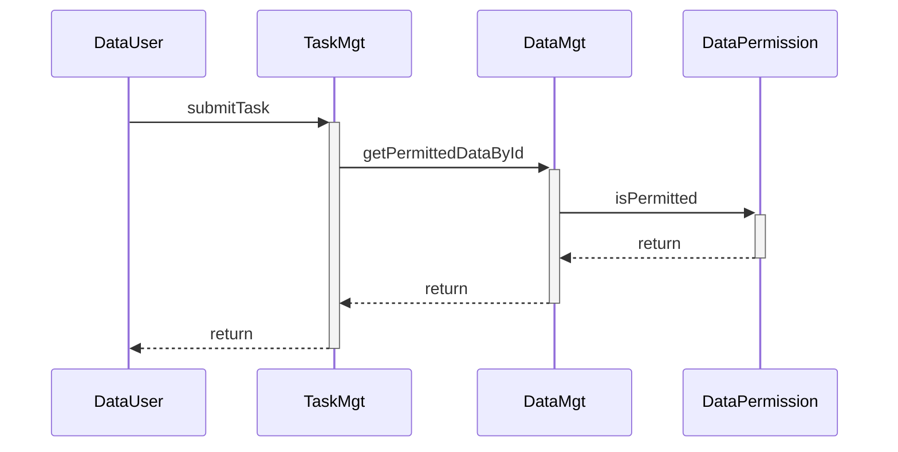

# Data Permission Control

```mermaid
sequenceDiagram
participant DataUser
participant TaskMgt
participant DataMgt
participant DataPermission
DataUser ->> +TaskMgt: submitTask
TaskMgt  ->> +DataMgt: getPermittedDataById
DataMgt  ->> +DataPermission: isPermitted
DataPermission  -->> -DataMgt: return
DataMgt         -->> -TaskMgt: return
TaskMgt         -->> -DataUser: return
```
