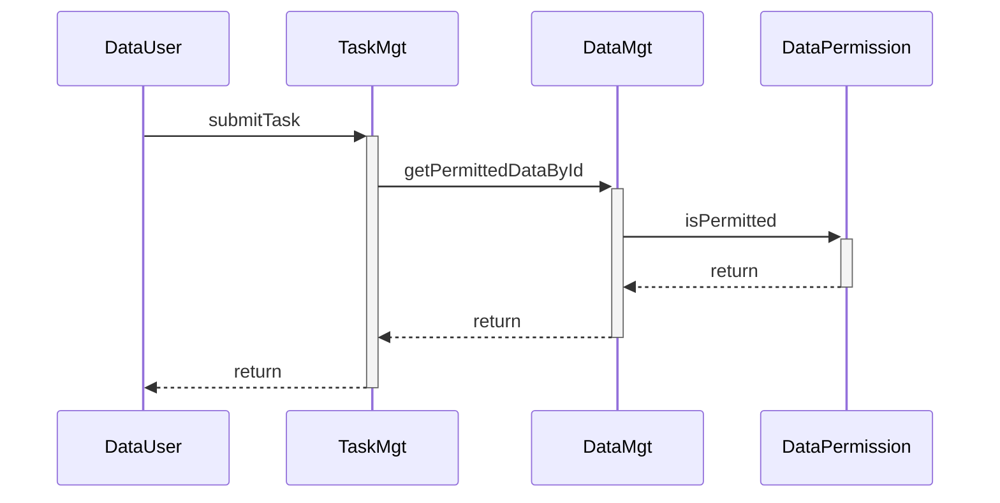

# Data Permission Control

- The `getPermittedDataById` is restricted to be called by TaskMgt when `Data User` submit tasks.
- For workers, `getDataById` should be called to retrive Data.
- For data users, `isDataPermitted` should be called before submitting tasks.
